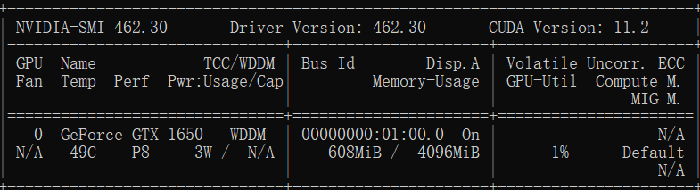
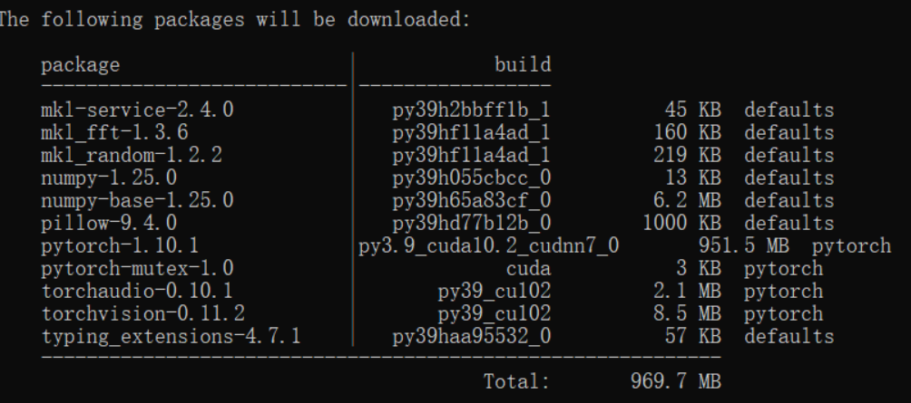

# datawhale week 1

## 环境安装

前面按照[Slide](https://gitee.com/anine09/learn-python-the-smart-way-v2/blob/main/slides/chapter_0-Installation.ipynb#https://gitee.com/link?target=https%3A%2F%2Fhelp.mirrors.cernet.edu.cn%2Fanaconda-extra%2F)操作还算正常

直到使用conda安装pytorch，

我笔记本显卡是GTX1650，
		```nvidia-smi```



cuda最新支持到11.2版本，于是在pytorch官网使用conda安装1.12.1版本的pytorch, 

`conda install pytorch==1.12.1 torchvision==0.13.1 torchaudio==0.12.1 cudatoolkit=10.2 -c pytorch`

 安装完成后进行测试 ==torch.cuda.is_available() 返回False==

-------------------

在https://pytorch.org/get-started/previous-versions/中可以找到之前发布的pytorch版本

https://download.pytorch.org/whl/torch/ 中可以发现python版本pytorch版本cuda版本windows平台不是很全，于是从pytorch==12.1开始向下尝试，出现图中pytorch为cuda版本时证明可行，最终1.10.1是符合我的平台的版本



--------------------

## 本地CNN例程

```python
# 训练集
train_loader = torch.utils.data.DataLoader(
    XunFeiDataset(train_path[:-1000], train_label[:-1000],
            A.Compose([
            A.RandomRotate90(),
            A.Resize(256, 256),
            A.RandomCrop(224, 224),
            A.HorizontalFlip(p=0.5),
            A.RandomContrast(p=0.5),
            A.RandomBrightnessContrast(p=0.5),
            A.Normalize(mean=(0.485, 0.456, 0.406), std=(0.229, 0.224, 0.225))
        ])
    ), batch_size=30, shuffle=True, num_workers=1, pin_memory=False
)
# 模型训练
def train(train_loader, model, criterion, optimizer):
    model.train()
    train_loss = 0.0
    for i, (input, target) in enumerate(train_loader):
        input = input.to(device)
        target = target.to(device)
        output = model(input)
        loss = criterion(output, target)
        optimizer.zero_grad()
        loss.backward()
        optimizer.step()

        if i % 100 == 0:
            print('Train loss', loss.item())
            
        train_loss += loss.item()
    return train_loss/len(train_loader)
```

在`for i, (input, target) in enumerate(train_loader):`处卡死，

后查明原因，根据[Training a Classifier — PyTorch Tutorials 2.0.1+cu117 documentation](https://pytorch.org/tutorials/beginner/blitz/cifar10_tutorial.html)

[DataLoader的num_workers设置引起卡死/堵塞/报错，以及CPU数据读取加速 - 知乎 (zhihu.com)](https://zhuanlan.zhihu.com/p/366595260#但实际上肯定是可以不设置成0，不放入main函数，还可以在win下用jupyter的。)

是由于在win jupyter中运行脚本，dataloader num_workers设成非0导致的

暂时解决办法，将num_workers设成0

## 补充

### 免换源方法（需要科学上网）

由于镜像源可能同步不及时，使用科学上网也可以加速下载，操作如下

conda:修改.condarc文件如下

```bash
proxy_servers:
  http: http://127.0.0.1:7890
  https: http://127.0.0.1:7890
ssl_verify: false
```

pip临时换源

```bash
pip install xxxx  --proxy 127.0.0.1:7890
```

取消与重设conda源：

```bash
channels:
  - defaults
show_channel_urls: true
default_channels:
  - https://mirrors.tuna.tsinghua.edu.cn/anaconda/pkgs/main
  - https://mirrors.tuna.tsinghua.edu.cn/anaconda/pkgs/r
  - https://mirrors.tuna.tsinghua.edu.cn/anaconda/pkgs/msys2
custom_channels:
  conda-forge: https://mirrors.tuna.tsinghua.edu.cn/anaconda/cloud
  pytorch: https://mirrors.tuna.tsinghua.edu.cn/anaconda/cloud
```

取消与重设pypi源：

```bash
# 设置 PyPI 镜像源
pip config set global.index-url https://mirrors.cernet.edu.cn/pypi/web/simple 
# 部分模块国更新不及时需要切换到官网 执行下面的命令  或者-i
pip config set global.index-url  https://pypi.org/simple  
pip install xx -i https://pypi.org/simple
```

### 连github网速过慢

表现为：Failed to connect to github.com port 443 after 21068 ms: Timed out

解决方案一：设置代理，需要开启科学上网

```bash
#设置代理
git config --global http.proxy http://127.0.0.1:7890 
git config --global https.proxy http://127.0.0.1:7890
```

取消代理

```bash
#取消代理
git config --global --unset http.proxy
git config --global --unset https.proxy
```

查看代理

```bash
# 查看代理
git config --global --get http.proxy
git config --global --get https.proxy
```

解决方案二：CDN加速（有可能会挂掉）

```bash
git config --global url."https://ghproxy.com/https://github.com".insteadOf "https://github.com" 
```

###  pytorch学习资源

[Deep Learning with PyTorch: A 60 Minute Blitz — PyTorch Tutorials 2.0.1+cu117 documentation](https://pytorch.org/tutorials/beginner/deep_learning_60min_blitz.html)


