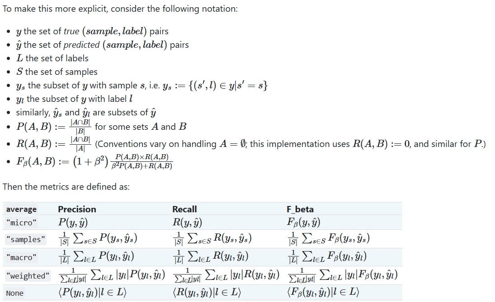

# week 2

## 改用与官方更为接近的macro-F1指标

### F1定义:



### sklearn API:

```py
def validate(val_loader, model, criterion):
    model.eval()
    #val_acc = 0.0
    for i, data in enumerate(val_loader()):
        input, target = data
        input = paddle.to_tensor(input)
        target = paddle.to_tensor(target)
        output = model(input)
        #print (f1_score(output.argmax(1), target,average='macro'))
        #val_acc += float((output.argmax(1) == target).sum())
        if i==0:
            all_output=output.argmax(1)
            all_target=target
        else:
            all_output=paddle.concat((all_output,output.argmax(1)), axis=0)
            all_target=paddle.concat((all_target,target), axis=0)
            
    #return val_acc / len(val_loader.dataset)
    return f1_score(all_output, all_target,average='macro')
```

### 问题：

1.自己验证集的分数和提交上去的还是会差很多，0.68和0.47，询问群里其他人也是如此，可能是官方用了对抗技术的原因

2.验证集比训练集f1-score一直要高

----


## 改用resnet-101模型

### 模型实现

```pyth
class XunFeiNet(paddle.nn.Layer):
    def __init__(self):
        super(XunFeiNet, self).__init__()
        self.layer=paddle.vision.models.resnet50(pretrained=True)
        self.fc = paddle.nn.Linear(1000, 25)
    def forward(self,x):
        x=self.layer(x)
        x=self.fc(x)
        return x
```

### 问题：

1.loss保持在3左右降不下去，==解决方法：沿用了resnet18时0.001学习率，后改依次使用0.0001，0.00005，0.00001有明显效果==

-----


## 改用vgg19模型

### 实现

```pyt
class XunFeiNet(paddle.nn.Layer):
    def __init__(self):
        super(XunFeiNet, self).__init__()
        self.layer=paddle.vision.models.vgg19(pretrained=True)
        self.fc = paddle.nn.Linear(1000, 25)
    def forward(self,x):
        x=self.layer(x)
        x=self.fc(x)
        return x
```

-------


## 模型融合

```python
import pandas as pd
import numpy as np

train_df1 = pd.read_csv('submit_resnet101_1_8.8.csv')
train_df2 = pd.read_csv('submit_resnet101_2_8.2.csv')
train_df3 = pd.read_csv('submit_resnet18_1_8.4.csv')
train_df4 = pd.read_csv('submit_resnet18_2_8.1.csv')
train_df5 = pd.read_csv('submit_vgg19_1_7.4.csv')
train_df6 = pd.read_csv('submit_vgg19_2_8.0.csv')
train_df1 = train_df1.sort_values(by='name')
train_df2 = train_df2.sort_values(by='name')
train_df3 = train_df3.sort_values(by='name')
train_df4 = train_df4.sort_values(by='name')
train_df5 = train_df5.sort_values(by='name')
train_df6 = train_df6.sort_values(by='name')
train_label1 = train_df1['label'].values
train_label2 = train_df2['label'].values
train_label3 = train_df3['label'].values
train_label4 = train_df4['label'].values
train_label5 = train_df5['label'].values
train_label6 = train_df6['label'].values

mystack=np.vstack((train_label1,train_label2,train_label3,train_label4,train_label5,train_label6))
result=[]
for i in mystack.T:
    li=i.tolist()
    result.append(max(li, key=li.count))
print(np.array(result).T)

submit = pd.DataFrame(
    {
        'name': train_df1['name'].values,
        'label': np.array(result).T
})

submit = submit.sort_values(by='name')
submit.to_csv('submit.csv', index=None)

```

